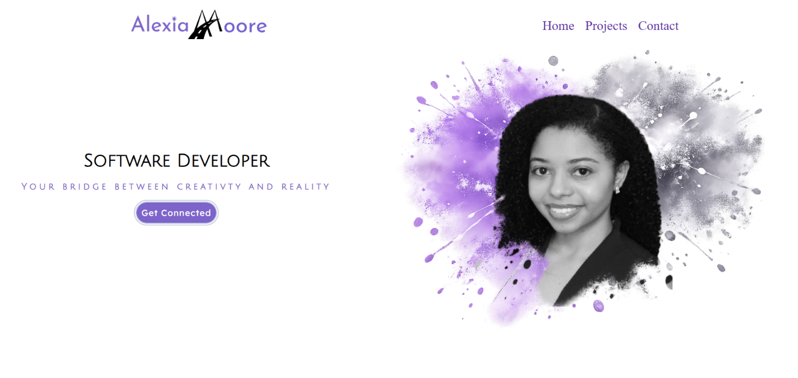
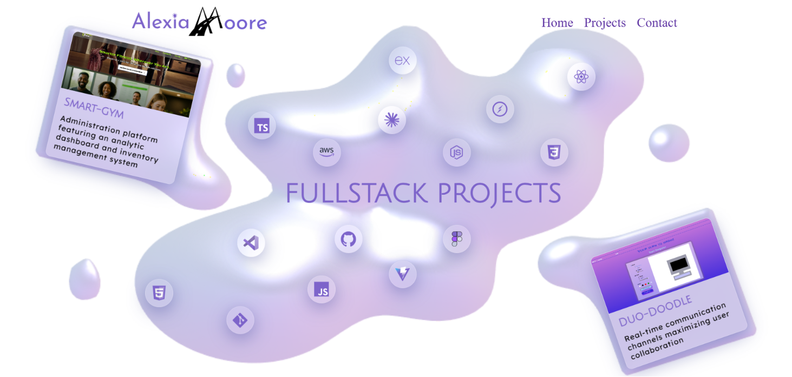
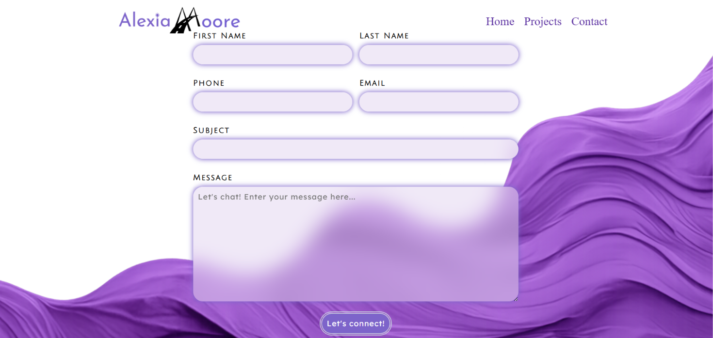

# Alexia Moore Portfolio

A custom portfolio website built with React, TypeScript, and Vite that showcases my software engineering projects through a unique visual design. The site combines modern frontend development practices with custom branding, original graphics, and responsive layouts to create a memorable user experience.

## Overview

This portfolio serves as a central hub for my software engineering work, featuring project highlights, contact functionality, and a custom visual identity designed entirely in Figma and implemented from scratch in code.

The design balances creativity and professionalism through paint splash graphics, fluid shapes, soft gradients, and custom branding while maintaining usability and accessibility across devices.

## Screenshots

### Hero Section



### Projects Section



### Contact Section



## Features

### Custom Designed User Interface

* Original logo and branding
* Custom graphics and visual assets
* Figma designs translated into production code
* Responsive layouts for desktop and mobile devices
* Modern glassmorphism and soft UI inspired styling

### Project Showcase

* Dedicated project cards highlighting full stack applications
* Technology focused presentation
* Interactive navigation between sections

### Contact System

* Contact form for professional inquiries
* Automated email response system
* Direct communication channel for recruiters and collaborators

### Performance Focused

* Built with Vite for fast development and optimized production builds
* Component based architecture using React
* Type safety through TypeScript

## Tech Stack

### Frontend

* React
* TypeScript
* Vite
* CSS

### Design

* Figma
* Custom graphic assets
* Responsive UI design

## Project Structure

```text
src/
├── assets/
├── components/
├── data/
│   └── projectData
├── styles/
├── App.tsx
├── main.tsx
└── vite-env.d.ts
```

## Getting Started

### Prerequisites

* Node.js
* npm

### Installation

Clone the repository:

```bash
git clone https://github.com/yourusername/portfolio.git
```

Navigate to the project directory:

```bash
cd portfolio
```

Install dependencies:

```bash
npm install
```

### Run Locally

```bash
npm run dev
```

### Build for Production

```bash
npm run build
```

### Preview Production Build

```bash
npm run preview
```

## Design Process

This portfolio began as a collection of custom Figma mockups focused on creating a memorable personal brand. Rather than relying on templates, every visual element was designed specifically for this project, including the logo, paint splash graphics, layout concepts, and overall visual language.

The goal was to create a portfolio that reflects both technical ability and creative problem solving by transforming original designs into a fully responsive React application.

## Future Improvements

* Project filtering and search functionality
* Animation enhancements
* Dark mode support
* Additional project case studies
* Accessibility improvements
* Performance monitoring and analytics

## Author

**Alexia Moore**

Software Engineer

LinkedIn: https://www.linkedin.com/in/alexia-moore-/

GitHub: https://github.com/EngineerMoore
